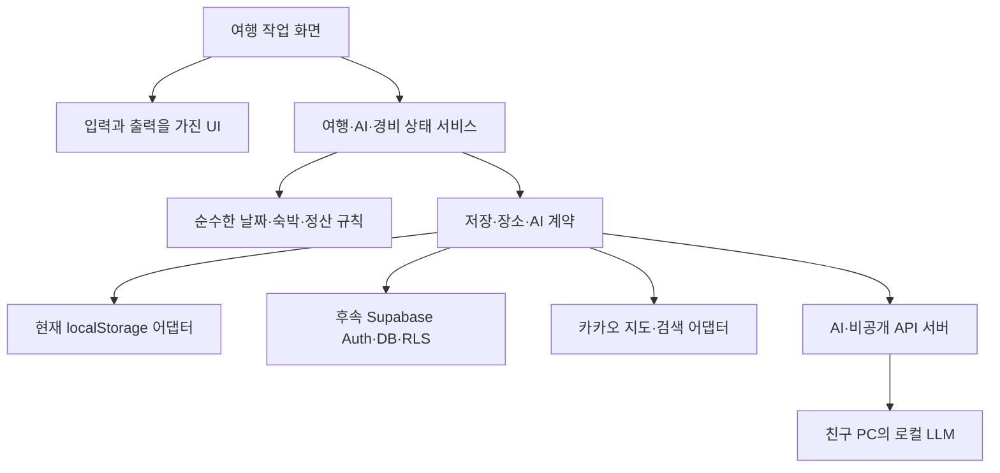

# 여행 앱 아키텍처·상태관리 기준

2026-09-09 설계 결정. 사용자가 지정한 Angular 프로젝트의 문서와 실제 코드를 비교한 결과다. 최신 지시에 따라 Angular 21 업그레이드를 목표로 한다. 현재 코드는 Angular 20이며 아래 업그레이드·폴더 이동·NgRx 설치·저장 경쟁 방지는 아직 구현하지 않았다. 제품 요구사항은 기획안과 OpenSpec, 시각 체계는 PRODUCT.md·DESIGN.md가 원본이다.

## 1. 선택과 근거

**Angular 21 + 기능별 구조 + Angular Signals + 서비스 내부 NgRx `signalState`를 채택한다.** 참고 프로젝트와 메이저 버전을 맞추고 단일 웹앱 규모에 맞게 적용한다. Angular 20이 더 우수해서 유지하는 것은 아니며, 초기 유지 제안은 변경 범위를 줄이기 위한 판단이었다. 사용자 최신 선택으로 이 판단을 대체한다.

| 선택지 | 판단 |
| --- | --- |
| Angular 기본 Signals만 사용 | 현재 알파에 충분하다. 작은 화면 상태에는 계속 사용한다. 복잡한 편집 상태는 팀 규칙을 더 일관되게 만들 필요가 있다. |
| 서비스 + NgRx `signalState` | 채택. 참고 프로젝트에서 실제 사용하는 방식이며 기존 서비스 형태를 유지하면서 관련 상태를 묶고 변경 메서드를 한곳에 둘 수 있다. |
| NgRx `signalStore` 또는 전통적 Store/Effects | 비교했으나 현재 필수로 도입하지 않는다. 여러 상태 서비스에서 상태 기능 조합을 반복하게 되면 `signalStore` 전환을 검토한다. 전체 앱 Redux 구성은 현재 규모에 과하다. |

`signalState`와 `signalStore`는 다른 API다. 이 프로젝트의 기본은 전자이며 두 방식을 같은 용도로 혼용하지 않는다. 라이브러리는 저장 순서·서버 충돌·권한을 자동 해결하지 않으므로 별도 계약과 검증이 필요하다. [NgRx SignalState](https://ngrx.io/guide/signals/signal-state), [비교한 SignalStore](https://ngrx.io/guide/signals/signal-store).

Angular core·CLI·build·compiler·forms·router는 21.x의 호환되는 릴리스로 함께 갱신하고 `@ngrx/signals`도 21.x를 사용한다. 구체적인 패치는 설치 시 확인하고 lockfile로 고정한다. 현재 확인한 Node 22.20.0, TypeScript 5.9, RxJS 7.8은 Angular 21 호환 범위에 들어간다. [Angular 호환표](https://angular.dev/reference/versions), [NgRx 21 요구 버전](https://ngrx.io/guide/migration/v21).

## 2. 참고 프로젝트에서 가져올 것과 조정할 것

| 항목 | 여행 앱에 적용할 기준 |
| --- | --- |
| 업무 영역별 폴더, feature/ui/data/model/util | 채택. 여행·AI·경비·동행 기능을 중심으로 배치한다. |
| Angular CLI의 apps/libs 구조 | 의존성 원칙만 채택. 현재 `app/`를 유지하고 내부에서 기능별로 정리한다. 여러 앱이나 실제 재사용 패키지가 생기면 분리한다. 참고 프로젝트도 Nx 명령 실행기를 사용하는 구조는 아니다. |
| 페이지가 상태 소유, UI는 입력·출력 | 채택. UI가 저장 서비스를 직접 수정하지 않는다. |
| `signalState`를 서비스 내부에 숨기기 | 채택. 읽을 상태만 노출하고 명명된 메서드로 수정한다. |
| Signal Forms 의무 사용 | Angular 21에서는 사용 가능하지만 experimental이다. 기본 폼은 typed Reactive Forms로 두고, 채택 검토 시 AI 입력처럼 독립된 흐름에서 복수 지역·숙소 날짜·단계 복원·검증을 실증한 뒤 범위를 결정한다. 전체 폼 자동 전환은 업그레이드 조건이 아니다. |
| 서버 조회 `rxResource` 의무 사용 | 참고 프로젝트의 설치된 Angular 21 타입에서도 experimental로 확인했다. 기본은 Promise 계약 또는 HttpClient/RxJS다. 필요하면 읽기 전용 조회 한 곳에서 검증하며 쓰기·정산 저장 도구로 사용하지 않는다. |
| Zoneless | 목표로 채택. Angular 21 업그레이드와 별도 검증 단계로 진행하며 지도 SDK 콜백·폼 프로그램 변경·저장 상태의 화면 갱신을 확인한 뒤 ZoneJS를 제거한다. |
| Tailwind·cva, Storybook, SSR, 외부 배포 체계 | 이번 아키텍처 결정의 필수 의존성으로 가져오지 않는다. 기존 CSS 토큰·테스트·클라이언트 렌더링을 유지한다. |

버전 판단 근거: [Angular 21 폼 안내](https://v21.angular.dev/guide/forms), [Angular 21 로드맵](https://v21.angular.dev/roadmap), [참고 프로젝트의 rxResource 타입](<C:/Users/123/Desktop/project/angular/01. work/web/node_modules/@angular/core/types/rxjs-interop.d.ts:181>), [Zoneless 공식 안내](https://angular.dev/guide/zoneless). 최신 문서의 안정화 상태와 21의 상태를 혼동하지 않는다. 기능 중심 구조는 [Angular 공식 스타일 가이드](https://angular.dev/style-guide#organize-your-project-by-feature-areas)에서도 권장한다. 아래 세부 폴더와 경계는 우리 앱의 설계 판단이다.

## 3. 목표 폴더와 의존성

필요한 기능을 구현할 때 폴더를 만든다. 빈 디렉터리를 미리 대량 생성하지 않는다.

```text
app/src/app/
  app.config.ts / app.routes.ts        # 초기화, 제공자 등록, lazy routes
  core/                               # 앱 설정 등 전역 인프라, 도메인 의존 금지
  features/
    trips/
      feature/                        # 목록, 여행 작업 화면, 생성·편집 화면
      ui/                             # 여행 헤더, 날짜 탭, 장소·숙소 카드
      data/                           # 편집 상태 서비스, Repository, 어댑터
      model/                          # 타입, 외부 요청·응답 계약
      util/                           # 순수한 날짜·숙박·일정 계산
      trips.routes.ts
    ai-planning/                      # 입력·생성·선택 초안, 검증, 적용 요청
    expenses/                         # 지출·분담·정산
    collaboration/                    # 코드·초대·멤버·공유
    places/                           # 지도·장소 검색·경로와 제공자 어댑터
    auth/                             # 사용자 세션
  shared/
    ui/                               # 버튼·대화상자·일반 상태 표시·아이콘
    util/                             # 도메인을 모르는 순수 함수
server/                               # AI·비공개 외부 API 서버, 도입 시 생성
supabase/                             # DB migrations·RLS, 연결 시 구성
```

- 화면 `feature`가 상태 서비스·UI를 조합한다. UI는 입력을 표시하고 사용자 의도를 출력한다. `data`가 UI나 화면을 import하지 않는다.
- `model`은 타입·상수, `util`은 계산·검증·변환 함수다. 둘 다 Angular·브라우저·SDK에 의존하지 않으며 util → model만 허용한다.
- `shared`와 `core`는 기능 폴더를 import하지 않는다. 버튼·모달은 shared, 여행 카드·숙소 규칙은 trips, 지도 SDK 어댑터는 places다. 여러 곳에서 쓴다는 이유만으로 업무 코드를 shared에 넣지 않는다.
- 한 화면 전용 코드는 그 화면 안에 둔다. 같은 기능의 여러 화면이 재사용하면 해당 기능 루트의 ui/data/util로 올린다. 전역 공통 UI는 업무 무관성과 실제 재사용을 함께 확인한다.
- 다른 기능의 화면 내부를 import하지 않는다. 공개 모델·작은 서비스 계약을 통한 단방향 의존만 허용한다. 예를 들어 여행 작업 화면이 경비 요약을 조합하되 경비 기능은 여행 화면이나 편집 상태를 참조하지 않는다.
- AI 초안은 현재 여행의 읽기 전용 스냅샷을 입력받고 적용 명령을 반환한다. 실제 일정 변경은 여행 편집 서비스가 담당한다. AI와 trips 서비스가 서로 참조하지 않는다.
- 응답 모델과 편집 모델이 다르거나 외부 신뢰 경계가 있을 때 매핑한다. 이름만 다른 동일 모델을 무조건 세 벌 만들지 않는다. API·LLM·localStorage 응답은 타입 선언만 믿지 않고 런타임 검증한다.
- 관련 파일과 테스트는 가까이 둔다. 큰 화면은 책임별 UI와 별도 HTML/CSS로 분리하되 줄 수만을 기준으로 쪼개지 않는다. 경계가 정해지면 lint로 순환 참조와 금지 import를 검증한다.

## 4. 상태의 소유자와 수명

| 상태 | 저장 위치·수명 | 규칙 |
| --- | --- | --- |
| 열린 모달·선택 마커·접힘 여부 | 컴포넌트 `signal` | 화면을 벗어나면 폐기 |
| 여행 ID·날짜 탭·복원할 필터 | Router URL | URL을 기준으로 복원, 별도 스토어에 중복 보관하지 않음 |
| 여행 목록과 조회 상태 | 목록 화면 서비스 | 편집 상태와 분리, 저장 뒤 재조회 또는 해당 요약 갱신 |
| 현재 여행·편집·저장 상태 | 여행 작업 화면 서비스의 private `signalState` | 작업 화면 부모 컴포넌트 providers에 등록, 자식 장소·숙소 편집은 같은 인스턴스 사용 |
| AI 입력·후보·선택·생성 상태 | AI 흐름 부모 화면 서비스의 private `signalState` | 단계 이동 시 유지, 새 요청·다른 여행·명시적 취소 시 구분 |
| 경비·정산, 초대·동행 | 해당 기능 서비스의 private `signalState` | 여행·사용자 ID로 구분, 여행 또는 계정 변경 시 이전 응답 폐기 |
| 로그인 세션 | auth 전역 서비스 | Supabase 연결 후 세션 수명에 맞춰 유지·정리 |
| 저장 실패한 입력 | 여행·사용자별 PendingDraftRegistry | 화면 서비스와 별도인 세션 메모리 보관소, 저장 성공·명시적 폐기 시 제거, 로그아웃 시 비공개 초안 정리 |
| 서버에 저장된 여행·경비·멤버 | Supabase 연결 후 DB | 클라이언트 상태는 조회·편집용 사본, 접근 권한과 저장 성공은 서버가 판단 |

편집 부모가 유지되는 장소·숙소 자식 경로는 같은 서비스 인스턴스를 사용한다. 같은 컴포넌트에서 여행 ID만 바뀌는 경우에도 이전 상태·요청을 명시적으로 초기화한다. Router 재사용 전략이 도입되면 서비스 수명을 다시 검증한다.

상태 필드에 TypeScript `readonly`를 붙이는 것만으로 `WritableSignal.set()`이 막히지는 않는다. 기본 signal은 private + `asReadonly()`, 복잡한 상태는 private `signalState`의 읽기 신호만 공개한다. 노출한 객체·배열도 직접 변경하지 않고 서비스 메서드에서 불변 갱신한다.

N박 N일·D-day·선택 개수·지출 합계는 원본에서 `computed`로 계산한다. `effect`로 같은 값을 다른 상태에 계속 복사하지 않는다. 정산의 최종 저장 검증은 서버에도 둔다.

## 5. 비동기·저장 계약

- 검색·여행 조회는 최신 요청만 화면에 반영한다. HttpClient는 `switchMap` 등으로 이전 조회를 해제하고, Promise·외부 SDK는 요청 번호와 여행·사용자 ID를 확인해 늦은 응답을 무시한다. [Angular HTTP 취소 안내](https://angular.dev/guide/http/making-requests).
- 조회 상태와 저장 상태를 분리한다. 목록·현재 여행·AI·경비 각각 오류를 소유한다. 경비 조회 실패를 0원, 장소 조회 실패를 확인된 장소로 바꾸지 않는다.
- 같은 여행의 쓰기는 순서를 보장한다. 저장 중 새 편집이 생기면 별도 편집 버전으로 유지한다. 이전 요청 성공이 더 최신 미저장 입력을 지우거나 전체를 저장 완료로 표시하면 안 된다. 이미 서버에서 실행 중인 쓰기는 구독 취소만으로 취소됐다고 가정하지 않는다.
- 실패한 입력은 같은 세션의 여행 이동 후에도 여행별로 재시도할 수 있게 한다. PendingDraftRegistry는 서버 캐시가 아니며 해당 입력의 저장 성공 전까지 보존한다. 새로고침·브라우저 종료 후 미저장 입력 복구는 별도 지속 저장 설계 전에는 보장하지 않는다. 종료 경고도 보장을 대신하지 않는다.
- 기존 `TripRepository`와 localStorage 어댑터는 초기 정리 동안 유지한다. Supabase 연결 시 여행 전체 `save(trip)`를 모든 기능의 영구 계약으로 고정하지 않는다. AI 적용·일정 변경·초대 승인·정산은 용도별 명령, 원본 버전, 재시도 식별자, 서버 트랜잭션이 필요한지 나눠 설계한다.
- 단일 사용자도 여러 탭·기기에서 저장할 수 있다. 서버 버전 충돌을 감지해 재검토하게 하고 오래된 전체 여행으로 최신 정보를 덮어쓰지 않는다. 실시간 공동 일정 편집은 기존 후속 범위를 유지한다.
- AI 생성 결과는 검증된 초안이다. 기본 전체 선택은 자동 저장이 아니며 사용자 적용 시 여행 버전과 중복 요청을 검증한다. 선택 토글마다 LLM을 다시 호출하지 않는다.

## 6. 전체 연결 구조



브라우저에 필요한 지도 공개 키와 서버 비밀키를 구분한다. LLM 주소·인증과 비공개 API 키는 서버 설정으로 관리한다. 인증된 DB 접근은 Supabase RLS, 초대·공유·정산 등 복합 명령은 서버/RPC 검증을 경계로 삼는다. 서버 경유만으로 권한이 자동 해결되는 것은 아니다. DB·LLM 연결 상태는 실제 호출 검증과 별도로 기록한다.

## 7. 현재 코드에서 바꿀 순서

착수 시점: 사용자가 현재 진행 중인 작업을 마친 뒤 별도로 리팩터링을 지시할 때 적용한다. 이 문서를 읽었다는 이유로 진행 중인 기능 작업을 중단하거나 업그레이드·구조 변경을 시작하지 않는다. 착수 시 최신 코드·패키지·완료 작업을 다시 확인하고 이미 반영된 항목은 반복하지 않는다. 아래 순서는 후속 리팩터링 안에서의 순서다.

1. 변경 전 앱 빌드·Vitest·핵심 E2E 결과를 확보한다. [Angular 업데이트 가이드](https://angular.dev/update-guide?v=20.0-21.0&l=1)에 따라 app/에서 core·CLI 20→21 공식 마이그레이션을 적용하고 빌드·테스트 설정과 관련 의존성을 확인한다. 작업 중인 다른 변경을 덮어쓰지 않는다. 전역 CLI 교체는 필요하지 않다. 현재 ZoneJS 설정은 이 단계에서 유지해 버전 변경만 먼저 검증한다.
2. `app/src/app/data/trip-store.ts`의 writable 상태 노출을 줄이고 조회·저장 경쟁과 여행별 실패 입력 보존 계약을 검증한다. 현재 root 단일 TripStore와 pending 한 개를 그대로 화면 범위로 옮기면 실패 입력이 소실될 수 있다.
3. 여행 작업 부모 화면과 목록 상태를 분리한다. 기존 domain 순수 함수·Repository를 보존하면서 trips의 model/util/data로 점진 이동한다. 큰 상세 화면의 헤더·일정·숙소 UI를 나눈다. 저장 상태 표시는 상태를 입력받는 공통 UI로 바꾼다. `@ngrx/signals` 21.x를 도입해 상태 서비스를 한 기능씩 옮긴다.
4. Zoneless로 전환하며 provideZoneChangeDetection·polyfills·테스트 설정을 함께 정리한다. 지도 콜백이 읽히는 signal을 갱신하는지, Reactive Forms의 프로그램 변경이 화면에 반영되는지 검증한다. 필요한 경우 valueChanges/statusChanges를 signal 또는 markForCheck로 연결한다. Signal Forms·rxResource 실증과는 각각 분리한다.
5. 기반 업그레이드 뒤 기존 우선순위인 지도 → AI → Supabase → 동행·공유 → 정산을 따른다. 새 기능은 이 구조로 작성하고 실제 사용하는 기능부터 이동한다. 폴더 전면 개편 때문에 지도·AI 연결을 미루지 않는다.
6. 변경마다 관련 Vitest와 빌드, 사용자 흐름이 변한 경우 별도 테스트 앱 Playwright를 실행한다. 조회 응답 역전·빠른 연속 저장·실패 후 여행 이동·재시도·여행 ID 변경·로그아웃을 검증하고 lint 경계를 추가한다. 서버 버전·권한·중복 명령 검증은 Supabase 단계에서 실제 DB로 수행한다.

## 8. 직접 확인한 참고 파일

아래 문서는 참고 프로젝트의 규칙이다. 배포·계정·업무 요구를 여행 앱에 자동 적용하지 않는다.

- [외부 ARCHITECTURE.md](<C:/Users/123/Desktop/project/angular/01. work/web/.claude/ARCHITECTURE.md>) — 기능별 구조, 상태 소유권, 공유 범위, import 경계.
- [외부 CODE.md](<C:/Users/123/Desktop/project/angular/01. work/web/.claude/CODE.md>) — Angular 작성 규칙과 버전 차이 검토.
- [외부 COMPONENTS.md](<C:/Users/123/Desktop/project/angular/01. work/web/.claude/COMPONENTS.md>) — 공통 UI 기준, 입력·출력, 접근성.
- [외부 TEST.md](<C:/Users/123/Desktop/project/angular/01. work/web/.claude/TEST.md>) — 테스트 구성 참고.
- [실제 PrepService](<C:/Users/123/Desktop/project/angular/01. work/web/libs/risk-assessment/feature/prep/data/prep.service.ts>) — private signalState와 patchState, 페이지 범위 상태 사용 확인.
- [실제 목록 화면](<C:/Users/123/Desktop/project/angular/01. work/web/libs/construction/feature/list/list.ts>) — rxResource와 Signal Forms 사용 확인.
- [외부 package.json](<C:/Users/123/Desktop/project/angular/01. work/web/package.json>) / [현재 package.json](app/package.json) — Angular·NgRx 버전 비교.

공식 문서 링크는 각 결정 옆에 표시했다. 참고 프로젝트와 공식 자료를 근거로 선택했으며, 상태 수명·여행별 복구·이행 순서는 여행 앱 요구에 맞춰 추가한 설계다.
