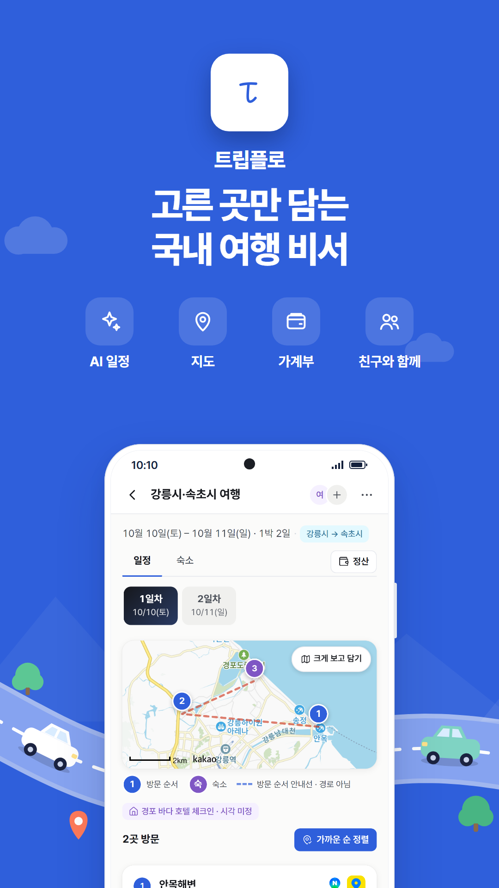
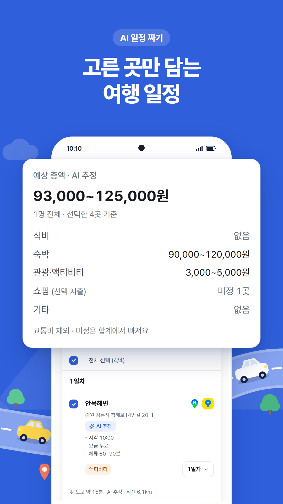
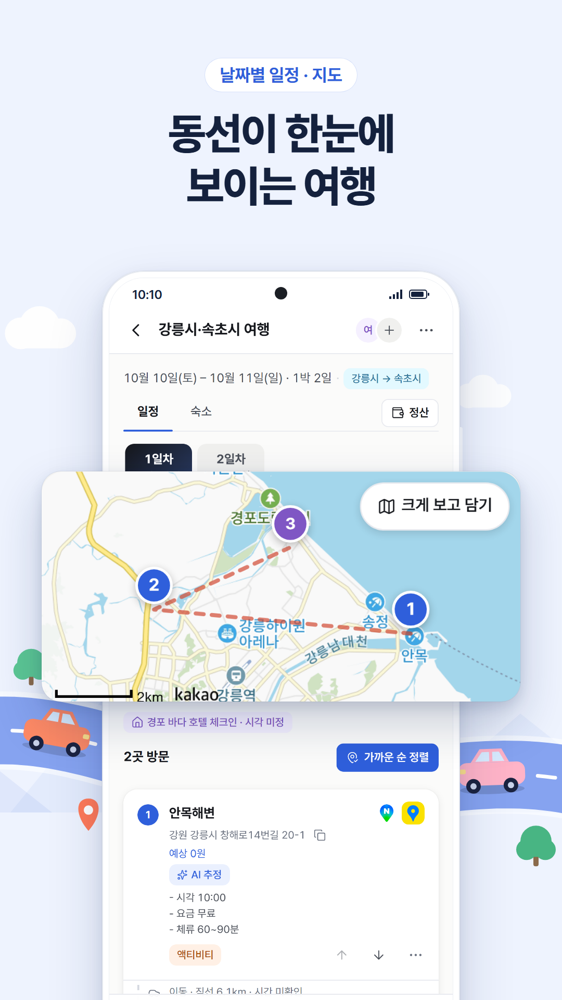
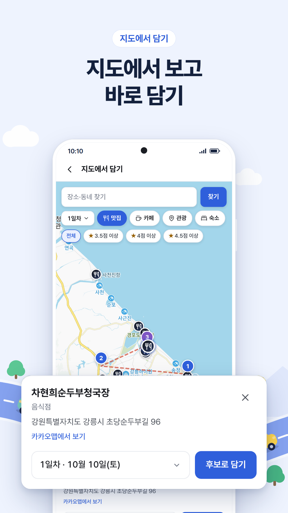
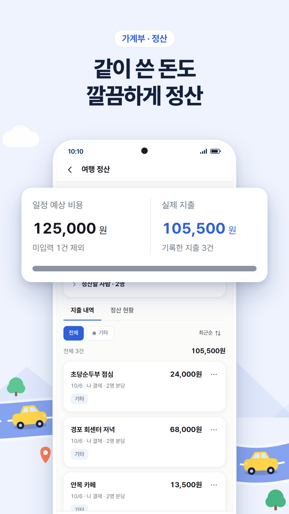

<div align="center">


# 트립플로

**고른 곳만 담는 국내 여행 비서**

AI가 추천한 장소 중 마음에 드는 곳만 골라 날짜별 일정을 만들고,<br>
지도·가계부·친구와 함께 여행을 끝까지 정리하는 반응형 웹/PWA

[](app/package.json)
[](docs/architecture/ARCHITECTURE.md)
[](docs/architecture/DATABASE.md)
[](https://triplo.pages.dev)


[**앱 열기 →**](https://triplo.pages.dev) · [문서 목차](docs/README.md) · [개발 안내](docs/DEVELOPMENT.md) · [기획안](docs/기획안-v0.1.md)

</div>

<p align="center">
  
  
  
  
  
</p>

---

## 무엇을 할 수 있나요

| | 기능 | 설명 |
| :---: | --- | --- |
| ✨ | **AI 일정 짜기** | 지역·기간·취향을 고르면 시간순 코스를 제안합니다. 마음에 드는 곳만 골라 담고, 예상 비용과 체류 시간은 `AI 추정`으로 구분해 보여 줍니다. |
| 🗺️ | **날짜별 일정과 지도** | 여러 지역·숙소 변경·숙소 미정까지 한 여행 안에서 정리합니다. 큰 지도에서 주변 맛집·카페를 보고 바로 담거나, 네이버·카카오 지도 링크로 담을 수 있습니다. |
| 🐧 | **AI 챗봇 펭이** | 여행 친구 펭귄 펭이에게 물어보면 추천을 확인 카드로 보여 주고, 담을지는 직접 정합니다. |
| 💸 | **가계부와 정산** | 영수증 사진으로 지출을 입력하고, 함께 쓴 돈을 누가 얼마 보낼지 정산합니다. |
| 👥 | **친구와 함께 편집** | 초대 링크 하나로 일정과 가계부를 함께 고칩니다. |
| 🔔 | **알림과 알림 내역** | 문의 답변·새 공지·함께 편집 소식을 웹 푸시로 받고, 지난 30일 알림을 앱 안에서 다시 봅니다. |
| 🌙 | **다크 모드** | 내 정보 > 설정에서 켜고 끕니다. 선택은 기기마다 남습니다. |
| 📍 | **방문 통계 지도** | 다녀온 지역이 입체 지도에 쌓입니다. |

> [!NOTE]
> 일정에 저장하는 좌표·주소·분류는 카카오·네이버 같은 검증된 출처에서만 가져옵니다. AI가 만든 값은 확인된 사실처럼 저장하지 않습니다.

## 현재 단계

**내부 알파**입니다. 소셜 로그인, 계정별 서버 저장(RLS), 초대 공동 편집, 공지·문의, 웹 푸시까지 운영 중입니다. 챗봇 대화 기록은 기기에 계정별로 남습니다.

- 남은 일: 개발·운영 DB 분리, Google Play 출시(TWA). 출시 절차는 [개발 안내](docs/DEVELOPMENT.md)에 있습니다.
- 진행 기록: [MVP 명세](openspec/changes/plan-travel-companion-mvp/proposal.md) · [작업 현황](openspec/changes/plan-travel-companion-mvp/tasks.md)

## 시작하기

```bash
cd app
npm ci                              # Node 22.20+ / npm 11 권장
npm start                           # 개발 앱 http://localhost:4200
```

| 명령 | 하는 일 |
| --- | --- |
| `npm test` | 순수 함수·저장소·상태 경쟁 단위 테스트 |
| `npm run lint` | 기능 경계·순환 참조 검사 |
| `npm run e2e` | 브라우저 시나리오(테스트 앱 4300). 처음 한 번 `npx playwright install chromium` |
| `npm run build` | 프로덕션 빌드 |
| `npm run spec:check` | OpenSpec 명세 검증(저장소 루트에서) |

<details>
<summary><b>키 설정</b></summary>

- **카카오 지도·장소 검색**: `app/public/app-config.example.json`을 `app-config.json`으로 복사해 JavaScript 키를 넣습니다. 키가 없어도 앱은 동작하고 지도·검색만 '연결 안 됨'으로 보입니다. 발급·도메인 등록은 [HARNESS.md](docs/HARNESS.md)의 '지도·장소 검색 제공자' 절을 따릅니다.
- **로그인(Supabase)**: `supabase-config.example.json`을 참고해 `supabase-config.json`을 만듭니다. 두 파일 모두 Git에 올리지 않습니다.

</details>

<details>
<summary><b>디자인 확인과 스토어 이미지</b></summary>

- 개발 앱의 [실험실](http://localhost:4200/lab)에서 공통 UI를 확인합니다. 토큰·규칙은 [DESIGN.md](docs/design/DESIGN.md)에 있습니다.
- 스토어 이미지 다시 만들기: `cd app && npx playwright test --config=playwright.store.config.ts`로 화면을 찍고(카카오 키 필요, 4200 사용), 저장소 루트에서 `node store/render.mjs`로 합성합니다. 결과는 `store/out/`에 생깁니다.

</details>

## 문서

| 문서 | 내용 |
| --- | --- |
| [문서 목차](docs/README.md) | 모든 문서의 시작점 |
| [아키텍처](docs/architecture/ARCHITECTURE.md) | Angular 21·NgRx Signals·Zoneless 구조와 상태 관리 |
| [데이터베이스](docs/architecture/DATABASE.md) | 표 구조·관계·접근 제어 |
| [기획안](docs/기획안-v0.1.md) · [화면 설계](docs/알파-화면설계-v0.1.md) | 사용 흐름·범위·화면별 시나리오 |
| [제품](docs/design/PRODUCT.md) · [디자인](docs/design/DESIGN.md) | 제품 방향과 디자인 기준 |
| [개발 도구](docs/HARNESS.md) | MCP·지도·인증 설정 |
