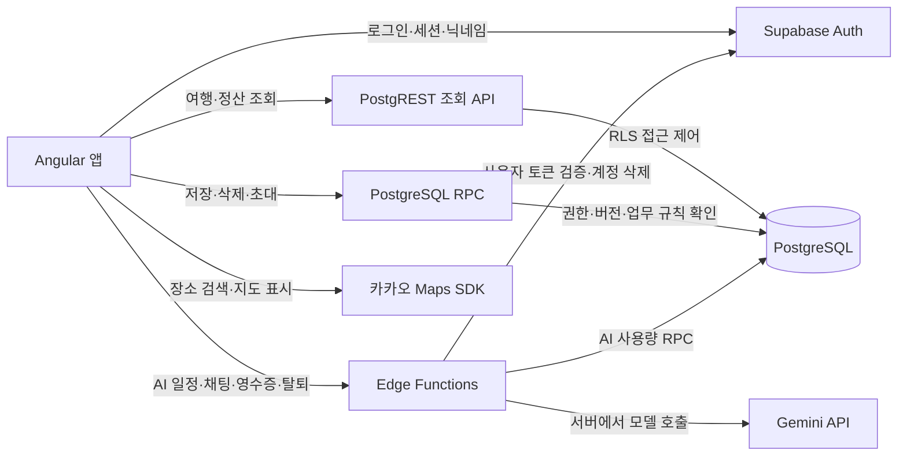
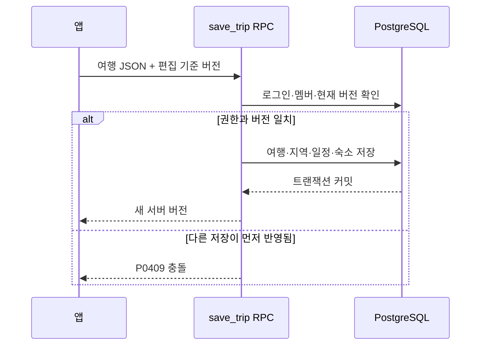

# API 구조와 호출 계약

2026-09-30 저장소 소스 기준. 실제 앱에서 사용하는 API를 기능별로 정리한다. 배포 상태·원격 응답을 이번 작업에서 확인한 것은 아니다. DB 관계는 [DATABASE.md](DATABASE.md), 운영 설정은 [HARNESS.md](../HARNESS.md)를 따른다.

## 1. 전체 호출 구조

| 구분 | 주소 형태 | 호출 방식 |
| --- | --- | --- |
| 테이블 조회 | `{SUPABASE_URL}/rest/v1/{table}` | Supabase SDK의 `from().select()` |
| 업무 RPC | `{SUPABASE_URL}/rest/v1/rpc/{name}` | SDK의 `rpc(name, args)`; 앱의 변경 요청은 POST |
| Edge Function | `{SUPABASE_URL}/functions/v1/{name}` | SDK의 `functions.invoke(name, { body })`; POST JSON |
| 인증 | Supabase Auth | SDK의 `auth.*` |
| 장소 검색 | 카카오 Maps JavaScript SDK | `services.Places().keywordSearch()` |

로그인 요청은 사용자 세션으로 처리한다. 비로그인 초대 미리보기는 공개 클라이언트의 `anon` 역할로 호출한다. 서버 비밀 키는 브라우저에 전달하지 않는다.

## 2. 조회 API

조회는 RLS가 허용한 행만 반환한다. 여행 멤버는 해당 여행을 읽으며 개인 지출과 분담은 작성자에게만 보인다. 응답이 비어 있는 것과 요청 실패는 구분해야 한다.

| 용도 | 조회 대상·조건 | 앱이 받는 값 |
| --- | --- | --- |
| 여행 목록 | `trips` + `trip_regions`·`trip_stops`·`accommodation_stays` 중첩 조회, `updated_at` 내림차순 | 여행 행 배열 |
| 여행 상세 | 같은 중첩 조회 + `id`, `maybeSingle()` | 여행 행 또는 null |
| 정산 | `trip_ledgers.budget`, `ledger_people`, `expenses` + `expense_splits`, `settlement_receipts`를 `trip_id`로 각각 조회 | 예산·사람·지출·수령을 앱에서 합친 `Ledger` |
| 초대 만료 | `trip_invites.expires_at`, `trip_id`, `maybeSingle()` | 소유자에게 만료 시각 또는 null |

정산 조회는 네 요청을 병렬 실행한다. 하나의 DB 트랜잭션 스냅샷으로 읽는 API는 아니다. `SupabaseLedgerRepository.read()`는 `self` 참여자가 없으면 `add_ledger_person`도 호출하므로 저장소 메서드 전체가 순수 조회인 것은 아니다.

원본: [trip-data-client.ts](../../app/src/app/features/trips/data/trip-data-client.ts), [ledger-data-client.ts](../../app/src/app/features/expenses/data/ledger-data-client.ts), [supabase-ledger-repository.ts](../../app/src/app/features/expenses/data/supabase-ledger-repository.ts), [supabase-trip-members.ts](../../app/src/app/features/collaboration/data/supabase-trip-members.ts).

## 3. 여행 저장·삭제 RPC

| 함수 | 요청 인자 | 성공 결과 | 권한·규칙 |
| --- | --- | --- | --- |
| `save_trip` | `p_trip: Trip`, `p_base_version: integer` | 새 서버 버전(integer) | 신규는 로그인 사용자, 기존은 여행 멤버. 신규 기준 버전 0, 기존은 조회한 버전 |
| `delete_trip` | `p_trip_id: text` | void | 여행 소유자만 삭제; 관련 행 cascade |

`p_trip`은 앱의 camelCase 모델이다. SQL 함수가 테이블 컬럼으로 변환한다. 여행·지역·일정·숙소는 `save_trip` 한 호출 안에서 함께 커밋하거나 함께 롤백한다.

원본: [최신 여행 저장·멤버 SQL](../../supabase/migrations/20260929000005_trip_members.sql), [Trip 모델](../../app/src/app/features/trips/model/trip.ts).

## 4. 정산 RPC

모두 로그인한 여행 멤버가 호출한다. 개인 지출 수정·삭제에는 작성자 제한이 추가된다. `void`는 성공 시 별도 업무 데이터를 반환하지 않는다는 뜻이다.

| 함수 | 요청 인자 | 성공 결과·규칙 |
| --- | --- | --- |
| `add_ledger_person` | `p_trip_id`, `p_person: { id, name }` | void; 사람 추가 또는 이름 변경 |
| `remove_ledger_person` | `p_trip_id`, `p_person_id` | void; `self` 삭제 거절, 참조 기록이 있으면 FK 거절 |
| `set_budget` | `p_trip_id`, `p_budget: integer 또는 null` | void; 예산 설정·미정 처리 |
| `save_expense` | `p_trip_id`, `p_expense: Expense`, `p_base_version` | 새 버전(integer); 지출과 분담을 한 트랜잭션으로 저장 |
| `delete_expense` | `p_trip_id`, `p_expense_id`, `p_base_version` | void; 버전 확인 후 삭제 |
| `add_receipt` | `p_trip_id`, `p_receipt: SettlementReceipt` | void; 잔액 확인 후 수령, 동일 id 재요청은 중복 생성하지 않음 |
| `cancel_receipt` | `p_trip_id`, `p_receipt_id`, `p_reason` | void; 취소 사유 기록 |

여러 정산 변경은 앱이 순서대로 RPC를 호출한다. **전체 가계부 변경 묶음이나 여행+정산 변경 전체를 하나의 원자적 저장으로 보장하지 않는다.** 중간 실패 시 앞선 성공이 남을 수 있다. 수령 추가는 여행 가계부 단위 잠금과 서버 잔액 검사로 처리한다.

원본: [호출자](../../app/src/app/features/expenses/data/supabase-ledger-repository.ts), [요청 모델](../../app/src/app/features/expenses/model/ledger.ts), [가계부 SQL](../../supabase/migrations/20260929000002_ledger_tables.sql), [사람 삭제](../../supabase/migrations/20260929000003_remove_ledger_person.sql), [멤버 권한 변경](../../supabase/migrations/20260929000005_trip_members.sql), [수령 검사](../../supabase/migrations/20260930000000_receipt_balance_guard.sql).

## 5. 초대·참여 RPC

| 함수 | 요청 인자 | 성공 결과 | 호출 권한 |
| --- | --- | --- | --- |
| `create_trip_invite` | `p_trip_id` | 초대 코드(text) | 소유자 |
| `revoke_trip_invite` | `p_trip_id` | void | 소유자 |
| `preview_trip_invite` | `p_code` | 미리보기 JSON | 비로그인 포함 |
| `join_trip` | `p_code` | 여행 id(text) | 로그인 사용자 |
| `leave_trip` | `p_trip_id` | void | 소유자가 아닌 본인 멤버 |
| `remove_trip_member` | `p_trip_id`, `p_user_id` | void | 소유자; 자신 제거는 거절 |

초대 코드는 정규화 후 조회하며 새로 발급하면 기존 코드가 무효화된다. 미리보기는 제목·기간·지역·제한된 장소/숙소 정보·소유자 닉네임과 현재 사용자 역할을 반환한다. 메모·주소·금액·가계부·여행 id는 미리보기에 포함하지 않는다.

원본: [호출자](../../app/src/app/features/collaboration/data/supabase-trip-members.ts), [미리보기 모델](../../app/src/app/features/collaboration/model/invite-preview.ts), [초대 SQL](../../supabase/migrations/20260929000005_trip_members.sql), [미리보기 역할 추가](../../supabase/migrations/20260929000007_preview_my_role.sql).

## 6. Edge Functions

네 함수 모두 POST와 OPTIONS를 처리하며 핸들러에서 Bearer 토큰을 검증한다. 성공 응답은 HTTP 200 JSON이다.

| 함수 | 요청 본문 | 성공 응답 |
| --- | --- | --- |
| `ai-plan` | `regions`, `dayCount`, `companion`, `transport`, `pace`, `taste`, `mustGo`, `bookedStay`, `extraNote` | `{ content: string, remaining: number }` |
| `ai-chat` | `input`, `scope: 'list' 또는 'trip'`, `history`, `trip` | `{ content: string, remaining: number }` |
| `receipt-scan` | `image: base64`, `mimeType`, `highlighted: boolean` | `{ content: string, remaining: number }` |
| `delete-account` | `{ confirmation: 'DELETE' }` | `{ deleted: true }` |

`content`는 JSON 객체 자체가 아니라 **JSON 내용을 담은 문자열**이다. 일정은 `parseAiItems`, 영수증은 `parseReceipt`가 앱에서 해석한다. 채팅은 서버와 앱 양쪽에서 `normalizeChatResponse`로 계약을 확인한다. AI 결과 수신 자체가 여행·지출 저장은 아니다. 장소 검증과 사용자 확인 후 별도 저장 흐름으로 진행한다.

### 요청 제한과 오류

| 함수 | 소스에 명시된 주요 제한 | 함수별 오류 |
| --- | --- | --- |
| `ai-plan` | 비어 있지 않은 지역 배열, 정수 `dayCount` 1~30 | 500 `generation_failed` |
| `ai-chat` | 입력 4,000자, 이력 최대 10개·각 6,000자, 요청 문자열 80,000자. 여행 문맥의 배열·문자열에도 별도 상한 | 502 `generation_failed`, 504 `model_timeout` |
| `receipt-scan` | base64 본문 최대 6,000,000자, JPEG·PNG·WebP | 413 `image_too_large`, 500 `scan_failed` |
| `delete-account` | 확인 문자열 `DELETE` 일치 | 400 `confirmation_required`, 500 `account_deletion_failed` |

공통으로 메서드 오류는 405 `method_not_allowed`, 인증 실패는 401 `authentication_required`다. AI 세 함수는 입력 검증 실패 400 `invalid_request`, 개인 한도 429 `{ error: 'user_limit', limit }`, 모델 제공자 한도 429 `quota_exceeded`, 사용량 검사 실패 503 `server_unavailable`을 구분한다.

AI 호출은 입력 검증 후 사용량을 차감하고 모델 처리 실패 시 환급을 시도한다. 앱에서만 발견한 파싱 실패까지 자동 환급하는 계약은 아니다. 영수증 사진은 현재 함수 구현에서 모델 요청으로 전달하며 DB나 Storage에 저장하는 코드는 없다.

`supabase/config.toml`에는 `ai-plan`·`ai-chat`·`delete-account`의 `verify_jwt = true`가 명시되어 있다. `receipt-scan`에는 개별 설정이 없으므로 실제 게이트웨이 설정은 이 문서에서 확정하지 않는다. 네 핸들러의 사용자 토큰 검증과 배포 설정은 구분한다.

원본: [ai-plan](../../supabase/functions/ai-plan/handler.ts), [ai-chat](../../supabase/functions/ai-chat/handler.ts), [채팅 응답 계약](../../supabase/functions/ai-chat/contract.ts), [receipt-scan](../../supabase/functions/receipt-scan/handler.ts), [delete-account](../../supabase/functions/delete-account/handler.ts), [함수 설정](../../supabase/config.toml).

## 7. 인증·외부 API·서버 전용 RPC

| 구분 | 현재 호출 | 역할 |
| --- | --- | --- |
| Supabase Auth | `signInWithOAuth({ provider })` | Google·Kakao 로그인 |
| Supabase Auth | `signOut({ scope: 'local' })` | 현재 브라우저 세션 로그아웃 |
| Supabase Auth | `updateUser({ data: { travel_nickname } })` | 닉네임 변경 |
| 카카오 SDK | `services.Places().keywordSearch(query, callback, options)` | 장소 후보의 이름·주소·좌표·분류·URL 조회 |
| Gemini | 서버에서 `POST .../v1beta/models/{model}:generateContent` | 일정·채팅·영수증 모델 호출 |
| `consume_ai_quota` | `p_user`, `p_kind`, `p_default_limit` → 남은 횟수 | `service_role` 전용 사용량 차감 |
| `refund_ai_quota` | `p_user`, `p_kind` → void | `service_role` 전용 사용량 환급 |

`is_trip_member`, `is_trip_owner`, `ledger_guard`, `ledger_balance`와 초대 코드 보조 함수는 SQL 정책·업무 함수에서 사용하는 보조 로직이다. 앱이 호출하는 업무 API 목록과 구분한다.

지도 검색 링크 열기는 외부 페이지 이동이며 장소 조회 API가 아니다. `app-config.json`과 지도 GeoJSON은 정적 파일 요청이다. 모델명·키·한도 설정의 운영 기준은 [AI-PLANNING.md](../AI-PLANNING.md)를 따른다.

원본: [AuthStore](../../app/src/app/features/auth/data/auth-store.ts), [카카오 검색](../../app/src/app/features/places/data/kakao/kakao-place-search.ts), [모델 호출 예시](../../supabase/functions/ai-plan/index.ts), [사용량 호출](../../supabase/functions/_shared/quota.ts), [사용량 SQL](../../supabase/migrations/20260929000004_ai_usage.sql).

## 8. RPC 오류 읽는 법

아래는 PostgreSQL의 SQLSTATE 코드이며 HTTP 상태 코드와 같지 않다. PostgREST가 반환하는 `error.code`를 기준으로 앱이 안내한다.

| 코드 | 의미 |
| --- | --- |
| `28000` | 로그인 필요 |
| `P0404` | 접근 권한 없음·대상 없음·유효하지 않은 초대 등. 초대는 `invite_invalid` 메시지 사용 |
| `P0409` | 저장 버전 충돌 또는 수령 잔액 충돌 |
| `P0422` | 분담·금액·취소 사유·소유자 탈퇴 등 업무 제약 위반; 함수별 의미 확인 |
| `P0429` | 서버 전용 AI 사용량 한도 초과; Edge Function이 HTTP 429로 변환 |
| `23503` | 외래 키 제약 위반 |
| `42501` | DB 실행·테이블 접근 권한 거부 |

## 9. 확인 범위

- 클라이언트 호출자·Edge 핸들러·누적 SQL 마이그레이션을 대조한 API 문서다.
- API·스키마·제품 코드는 변경하지 않았다. 기능 변경이나 새 API 설계가 아니므로 기획안·OpenSpec의 기능 범위는 유지한다.
- 원격 호출, 실제 인증, DB 통합 테스트와 배포 상태는 이번 작업에서 검증하지 않았다.
