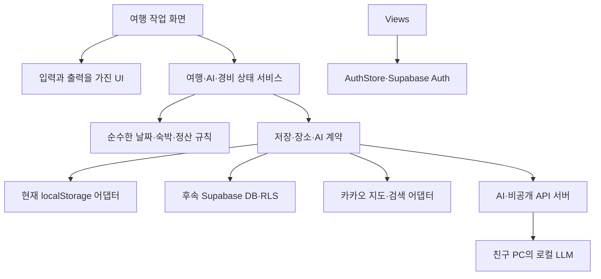

# 여행 앱 아키텍처·상태관리 기준

현재 구현은 Angular 21·NgRx Signals·Zoneless와 기능별 구조다. 실제 패치 버전은 app/package.json과 잠금 파일, 검증 기록은 OpenSpec tasks 9·11절을 따른다. 제품 요구는 기획안·OpenSpec, 시각 규칙은 docs/design/DESIGN.md에서 관리한다.

## 1. 선택과 근거

**Angular 21 + 기능별 구조 + Angular Signals + 서비스 내부 NgRx `signalState`를 채택한다.** 참고 프로젝트와 메이저 버전을 맞추고 단일 웹앱 규모에 맞게 적용한다.

| 선택지 | 판단 |
| --- | --- |
| Angular 기본 Signals만 사용 | 현재 알파에 충분하다. 작은 화면 상태에는 계속 사용한다. 복잡한 편집 상태는 팀 규칙을 더 일관되게 만들 필요가 있다. |
| 서비스 + NgRx `signalState` | 채택. 참고 프로젝트에서 실제 사용하는 방식이며 기존 서비스 형태를 유지하면서 관련 상태를 묶고 변경 메서드를 한곳에 둘 수 있다. |
| NgRx `signalStore` 또는 전통적 Store/Effects | 비교했으나 현재 필수로 도입하지 않는다. 여러 상태 서비스에서 상태 기능 조합을 반복하게 되면 `signalStore` 전환을 검토한다. 전체 앱 Redux 구성은 현재 규모에 과하다. |

`signalState`와 `signalStore`는 다른 API다. 이 프로젝트의 기본은 전자이며 두 방식을 같은 용도로 혼용하지 않는다. 라이브러리는 저장 순서·서버 충돌·권한을 자동 해결하지 않으므로 별도 계약과 검증이 필요하다. [NgRx SignalState](https://ngrx.io/guide/signals/signal-state), [비교한 SignalStore](https://ngrx.io/guide/signals/signal-store).

Angular core·CLI·build·compiler·forms·router는 21.x의 호환되는 릴리스로 함께 갱신하고 `@ngrx/signals`도 21.x를 사용한다. 구체적인 패치는 설치 시 확인하고 lockfile로 고정한다. 현재 확인한 Node 22.20.0, TypeScript 5.9, RxJS 7.8은 Angular 21 호환 범위에 들어간다. [Angular 호환표](https://angular.dev/reference/versions), [NgRx 21 요구 버전](https://ngrx.io/guide/migration/v21).

## 2. 참고 프로젝트에서 가져올 것과 조정할 것

| 항목 | 여행 앱에 적용할 기준 |
| --- | --- |
| 업무 영역별 폴더, feature/ui/data/model/util | 채택. 여행·AI·경비·동행 기능을 중심으로 배치한다. |
| Angular CLI의 apps/libs 구조 | 의존성 원칙만 채택. 현재 `app/`를 유지하고 내부에서 기능별로 정리한다. 여러 앱이나 실제 재사용 패키지가 생기면 분리한다. 참고 프로젝트도 Nx 명령 실행기를 사용하는 구조는 아니다. |
| 페이지가 상태 소유, UI는 입력·출력 | 채택. UI가 저장 서비스를 직접 수정하지 않는다. |
| `signalState`를 서비스 내부에 숨기기 | 채택. 읽을 상태만 노출하고 명명된 메서드로 수정한다. |
| Signal Forms 의무 사용 | Angular 21에서는 사용 가능하지만 experimental이다. 새 복잡한 폼의 기본은 typed Reactive Forms로 두고(기존 signal + ngModel 폼은 유지), 채택 검토 시 AI 입력처럼 독립된 흐름에서 복수 지역·숙소 날짜·단계 복원·검증을 실증한 뒤 범위를 결정한다. 전체 폼 자동 전환은 업그레이드 조건이 아니다. |
| 서버 조회 `rxResource` 의무 사용 | 참고 프로젝트의 설치된 Angular 21 타입에서도 experimental로 확인했다. 기본은 Promise 계약 또는 HttpClient/RxJS다. 필요하면 읽기 전용 조회 한 곳에서 검증하며 쓰기·정산 저장 도구로 사용하지 않는다. |
| Zoneless | 목표로 채택. Angular 21 업그레이드와 별도 검증 단계로 진행하며 지도 SDK 콜백·폼 프로그램 변경·저장 상태의 화면 갱신을 확인한 뒤 ZoneJS를 제거한다. |
| Tailwind CSS | 2026-09-14 사용자 요청으로 v4와 공식 PostCSS 플러그인을 채택한다. 단일 테마 토큰·공통 UI·실험실로 화면 일관성을 관리한다. |
| cva, Storybook, SSR, 외부 배포 체계 | 필수 의존성으로 추가하지 않는다. 디자인 시스템 예제는 앱 실험실 /lab에서 제공한다. |

버전 판단 근거: [Angular 21 폼 안내](https://v21.angular.dev/guide/forms), [Angular 21 로드맵](https://v21.angular.dev/roadmap), [참고 프로젝트의 rxResource 타입](<C:/Users/123/Desktop/project/angular/01. work/web/node_modules/@angular/core/types/rxjs-interop.d.ts:181>), [Zoneless 공식 안내](https://angular.dev/guide/zoneless). 최신 문서의 안정화 상태와 21의 상태를 혼동하지 않는다. 기능 중심 구조는 [Angular 공식 스타일 가이드](https://angular.dev/style-guide#organize-your-project-by-feature-areas)에서도 권장한다. 아래 세부 폴더와 경계는 우리 앱의 설계 판단이다.

## 3. 폴더와 의존성

필요한 기능을 구현할 때 폴더를 만든다. 빈 디렉터리를 미리 대량 생성하지 않는다.

```text
app/src/app/
  app.config.ts / app.routes.ts        # 초기화, 제공자 등록, lazy routes
  core/                               # 앱 설정 등 전역 인프라, 도메인 의존 금지
  features/
    trips/
      feature/                        # 목록, 여행 작업 화면, 생성·편집 화면
      ui/                             # 여행 헤더, 날짜 탭, 장소·숙소 카드
      data/                           # 편집 상태 서비스, Repository, 어댑터
      model/                          # 타입, 외부 요청·응답 계약
      util/                           # 순수한 날짜·숙박·일정 계산
      trips.routes.ts
    ai-planning/                      # 입력·생성·선택 초안, 검증, 적용 요청
    places/                           # 지도·장소 검색·경로와 제공자 어댑터
    auth/                             # 소셜 인증·닉네임·계정
    lab/                              # 공통 UI·토큰 실험실
  shared/
    ui/                               # 버튼·대화상자·일반 상태 표시·아이콘
    util/                             # 도메인을 모르는 순수 함수
server/                               # AI·비공개 외부 API 서버, 도입 시 생성
supabase/functions/delete-account/    # 본인 탈퇴 함수. 미배포
# expenses·collaboration·DB migrations/RLS는 후속 기능 구현 시 추가
```

- 화면 `feature`가 상태 서비스·UI를 조합한다. UI는 입력을 표시하고 사용자 의도를 출력한다. `data`가 UI나 화면을 import하지 않는다.
- `model`은 타입·상수, `util`은 계산·검증·변환 함수다. 둘 다 Angular·브라우저·SDK에 의존하지 않으며 util → model만 허용한다.
- `shared`와 `core`는 기능 폴더를 import하지 않는다. 버튼·모달은 shared, 여행 카드·숙소 규칙은 trips, 지도 SDK 어댑터는 places다. 여러 곳에서 쓴다는 이유만으로 업무 코드를 shared에 넣지 않는다.
- 한 화면 전용 코드는 그 화면 안에 둔다. 같은 기능의 여러 화면이 재사용하면 해당 기능 루트의 ui/data/util로 올린다. 전역 공통 UI는 업무 무관성과 실제 재사용을 함께 확인한다.
- 다른 기능의 화면 내부를 import하지 않는다. 공개 모델·작은 서비스 계약을 통한 단방향 의존만 허용한다. 예를 들어 여행 작업 화면이 경비 요약을 조합하되 경비 기능은 여행 화면이나 편집 상태를 참조하지 않는다. 다른 기능의 화면을 라우트에 붙일 때는 그 기능이 공개한 `<기능>.routes.ts`를 `loadChildren`으로 부른다.
- 경계 검사(`npm run lint`)를 고치거나 새 규칙을 넣으면 **일부러 위반을 만들어 실제로 실패하는지 확인한다.** 2026-09-17 감리에서 Windows 경로 표기 차이(`C:/` 대 `C:\`) 때문에 내부 import를 전부 건너뛰고도 '통과'를 출력하던 결함을 찾았다. 통과 메시지만으로는 검사가 동작했는지 알 수 없다.
- AI 초안은 현재 여행의 읽기 전용 스냅샷을 입력받고 적용 명령을 반환한다. 실제 일정 변경은 여행 편집 서비스가 담당한다. AI와 trips 서비스가 서로 참조하지 않는다.
- 응답 모델과 편집 모델이 다르거나 외부 신뢰 경계가 있을 때 매핑한다. 이름만 다른 동일 모델을 무조건 세 벌 만들지 않는다. API·LLM·localStorage 응답은 타입 선언만 믿지 않고 런타임 검증한다.
- 모든 컴포넌트는 이름별 폴더에 같은 이름의 `.ts`·`.html`을 함께 둔다. 공통 호스트 클래스는 같은 폴더의 `.styles.ts`에, 테스트도 해당 폴더에 둔다. 작은 컴포넌트도 인라인 `template`·`styles`를 사용하지 않는다. 예: `features/auth/feature/onboarding/onboarding.ts`와 `.html`, `shared/ui/button/button.ts`와 `.html`. 순수 서비스·모델·유틸리티는 기존 계층을 유지한다. lint로 컴포넌트 폴더·템플릿 분리·의존성 경계·순환 참조를 검증한다.
- 화면 스타일은 HTML의 Tailwind 유틸리티로 작성한다. 공통 UI 호스트의 정적 클래스는 `.styles.ts`에서 공유한다. `app/src/styles/theme.css`는 테마 토큰의 실행 원본, `base.css`는 기반 스타일, `effects.css`는 키프레임과 동작 줄이기 설정이다. 컴포넌트 CSS 파일은 제거했으며 지도 SDK가 생성하는 DOM도 정적 Tailwind 클래스 모음을 사용한다. 기능별 임의 색상·입력·버튼 규칙을 새로 만들기 전에 `shared/ui`의 버튼·입력·필드·체크박스·배지·안내·로딩·토스트·동작 바·탭·행 더보기를 사용한다. 목록 행의 수정·삭제는 버튼을 늘어놓지 않고 `row-menu`에 모으며, 삭제는 `danger`로 표시하고 같은 화면 안에서 확인을 받는다.
- 실험실 `features/lab/feature/lab/`는 실제 공유 컴포넌트와 테마 토큰으로 예제를 렌더링한다. `/lab`은 계정 데이터를 읽지 않는 공개 컴포넌트 예제이며 여행 인증 가드와 독립적이다. 제품과 다른 모사 UI를 별도로 만들지 않는다.

## 4. 상태의 소유자와 수명

| 상태 | 저장 위치·수명 | 규칙 |
| --- | --- | --- |
| 열린 모달·선택 마커·접힘 여부 | 컴포넌트 `signal` | 화면을 벗어나면 폐기 |
| 여행 ID·날짜 탭·복원할 필터 | Router URL | URL을 기준으로 복원, 별도 스토어에 중복 보관하지 않음 |
| 여행 목록과 조회 상태 | 목록 화면 서비스 | 편집 상태와 분리, 저장 뒤 재조회 또는 해당 요약 갱신 |
| 현재 여행·편집·저장 상태 | 여행 작업 화면 서비스의 private `signalState` | 작업 화면 부모 컴포넌트 providers에 등록, 자식 장소·숙소 편집은 같은 인스턴스 사용 |
| AI 입력·후보·선택·생성 상태 | AI 흐름 부모 화면 서비스의 private `signalState` | 단계 이동 시 유지, 새 요청·다른 여행·명시적 취소 시 구분 |
| 경비·정산, 초대·동행 | 해당 기능 서비스의 private `signalState` | 여행·사용자 ID로 구분, 여행 또는 계정 변경 시 이전 응답 폐기 |
| 로그인 세션 | auth 전역 서비스 | AuthStore가 인증 복원·변경·로그아웃을 관리 |
| 저장 실패한 입력 | 여행·사용자별 PendingDraftRegistry | 화면 서비스와 별도인 세션 메모리 보관소, 저장 성공·명시적 폐기 시 제거, 로그아웃 시 비공개 초안 정리 |
| 서버에 저장된 여행·경비·멤버 | Supabase 연결 후 DB | 클라이언트 상태는 조회·편집용 사본, 접근 권한과 저장 성공은 서버가 판단 |

편집 부모가 유지되는 장소·숙소 자식 경로는 같은 서비스 인스턴스를 사용한다. 같은 컴포넌트에서 여행 ID만 바뀌는 경우에도 이전 상태·요청을 명시적으로 초기화한다. Router 재사용 전략이 도입되면 서비스 수명을 다시 검증한다.

상태 필드에 TypeScript `readonly`를 붙이는 것만으로 `WritableSignal.set()`이 막히지는 않는다. 기본 signal은 private + `asReadonly()`, 복잡한 상태는 private `signalState`의 읽기 신호만 공개한다. 노출한 객체·배열도 직접 변경하지 않고 서비스 메서드에서 불변 갱신한다.

N박 N일·D-day·선택 개수·지출 합계는 원본에서 `computed`로 계산한다. `effect`로 같은 값을 다른 상태에 계속 복사하지 않는다. 정산의 최종 저장 검증은 서버에도 둔다.

## 5. 비동기·저장 계약

- 검색·여행 조회는 최신 요청만 화면에 반영한다. HttpClient는 `switchMap` 등으로 이전 조회를 해제하고, Promise·외부 SDK는 요청 번호와 여행·사용자 ID를 확인해 늦은 응답을 무시한다. [Angular HTTP 취소 안내](https://angular.dev/guide/http/making-requests).
- 조회 상태와 저장 상태를 분리한다. 목록·현재 여행·AI·경비 각각 오류를 소유한다. 경비 조회 실패를 0원, 장소 조회 실패를 확인된 장소로 바꾸지 않는다.
- 같은 여행의 쓰기는 순서를 보장한다. 저장 중 새 편집이 생기면 별도 편집 버전으로 유지한다. 이전 요청 성공이 더 최신 미저장 입력을 지우거나 전체를 저장 완료로 표시하면 안 된다. 이미 서버에서 실행 중인 쓰기는 구독 취소만으로 취소됐다고 가정하지 않는다.
- 실패한 입력은 같은 세션의 여행 이동 후에도 여행별로 재시도할 수 있게 한다. PendingDraftRegistry는 서버 캐시가 아니며 해당 입력의 저장 성공 전까지 보존한다. 새로고침·브라우저 종료 후 미저장 입력 복구는 별도 지속 저장 설계 전에는 보장하지 않는다. 종료 경고도 보장을 대신하지 않는다.
- 기존 `TripRepository`와 localStorage 어댑터는 초기 정리 동안 유지한다. Supabase 연결 시 여행 전체 `save(trip)`를 모든 기능의 영구 계약으로 고정하지 않는다. AI 적용·일정 변경·초대 승인·정산은 용도별 명령, 원본 버전, 재시도 식별자, 서버 트랜잭션이 필요한지 나눠 설계한다.
- 단일 사용자도 여러 탭·기기에서 저장할 수 있다. 서버 버전 충돌을 감지해 재검토하게 하고 오래된 전체 여행으로 최신 정보를 덮어쓰지 않는다. 실시간 공동 일정 편집은 기존 후속 범위를 유지한다.
- AI 생성 결과는 검증된 초안이다. 기본 전체 선택은 자동 저장이 아니며 사용자 적용 시 여행 버전과 중복 요청을 검증한다. 선택 토글마다 LLM을 다시 호출하지 않는다.

## 6. 전체 연결 구조



브라우저에 필요한 지도 공개 키와 서버 비밀키를 구분한다. LLM 주소·인증과 비공개 API 키는 서버 설정으로 관리한다. 인증된 DB 접근은 Supabase RLS, 초대·공유·정산 등 복합 명령은 서버/RPC 검증을 경계로 삼는다. 서버 경유만으로 권한이 자동 해결되는 것은 아니다. DB·LLM 연결 상태는 실제 호출 검증과 별도로 기록한다.

## 7. 변경과 검증

Angular 21 마이그레이션·기능별 상태 분리·Zoneless 전환은 적용했다. 최초 이행 절차를 반복하지 않고 현재 코드에서 변경 범위를 정한다. 기존 domain 코드는 trips의 model/util/data로 이동했으며 새 기능도 같은 계층을 따른다.

변경에 맞는 단위·경계·빌드 검증을 실행하고 사용자 흐름이 바뀌면 별도 테스트 앱에서 PC·360px 브라우저 검증을 수행한다. 서버 버전·권한·중복 명령·트랜잭션은 Supabase DB 단계에서 실제 서버로 검증한다. 후속 기능 순서는 DEVELOPMENT.md를 따른다.

### 파일과 서식

컴포넌트 파일명에서 `-page` 접미사는 사용하지 않는다. 예: `onboarding/onboarding.ts`·`onboarding.html`. PascalCase 클래스 이름은 라우트 컴포넌트 구분을 위해 유지할 수 있다.

TypeScript 함수·메서드 사이와 속성/생성자 영역 사이에는 빈 줄을 한 줄만 둔다. 들여쓰기·줄바꿈은 app/package.json의 Prettier 설정을 따른다.

### 개발용 미리보기

development 구성만 `designPreview=true`로 여행·계정·온보딩 진입을 허용한다. production과 test는 false로 인증·닉네임 가드를 유지한다. 미리보기 표시를 실제 AuthStore 세션으로 만들지 않는다. 실제 인증 사용자가 닉네임 저장에 성공하면 개발 앱에서도 여행 목록으로 이동한다.

## 8. 직접 확인한 참고 파일

아래 문서는 참고 프로젝트의 규칙이다. 배포·계정·업무 요구를 여행 앱에 자동 적용하지 않는다.

- [외부 ARCHITECTURE.md](<C:/Users/123/Desktop/project/angular/01. work/web/.claude/ARCHITECTURE.md>) — 기능별 구조, 상태 소유권, 공유 범위, import 경계.
- [외부 CODE.md](<C:/Users/123/Desktop/project/angular/01. work/web/.claude/CODE.md>) — Angular 작성 규칙과 버전 차이 검토.
- [외부 COMPONENTS.md](<C:/Users/123/Desktop/project/angular/01. work/web/.claude/COMPONENTS.md>) — 공통 UI 기준, 입력·출력, 접근성.
- [외부 TEST.md](<C:/Users/123/Desktop/project/angular/01. work/web/.claude/TEST.md>) — 테스트 구성 참고.
- [실제 PrepService](<C:/Users/123/Desktop/project/angular/01. work/web/libs/risk-assessment/feature/prep/data/prep.service.ts>) — private signalState와 patchState, 페이지 범위 상태 사용 확인.
- [실제 목록 화면](<C:/Users/123/Desktop/project/angular/01. work/web/libs/construction/feature/list/list.ts>) — rxResource와 Signal Forms 사용 확인.
- [외부 package.json](<C:/Users/123/Desktop/project/angular/01. work/web/package.json>) / [현재 package.json](../../app/package.json) — Angular·NgRx 버전 비교.

공식 문서 링크는 각 결정 옆에 표시했다. 참고 프로젝트와 공식 자료를 근거로 선택했으며, 상태 수명·여행별 복구·이행 순서는 여행 앱 요구에 맞춰 추가한 설계다.


### 로컬 비용·공유 화면 (2026-09-14)
`features/expenses`는 순수 원화 분담/정산 모델·util, 기기 저장 data, 지출 폼 ui, 가계부 feature로 나눈다. `features/collaboration`은 동행 ui와 초대/공유 미리보기 feature를 제공한다. 여행 PNG는 순수 출력 모델(util)과 Canvas renderer(data), 미리보기 ui/화면(feature)로 분리한다. 여행 저장소는 기존 localStorage를 유지하며 실제 서버 공유나 권한을 대체하지 않는다.
